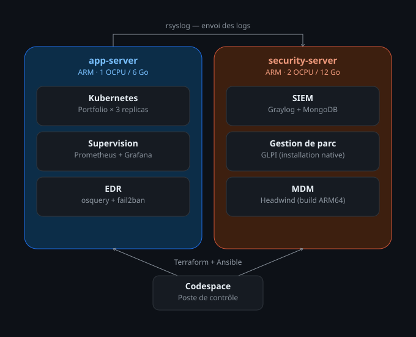
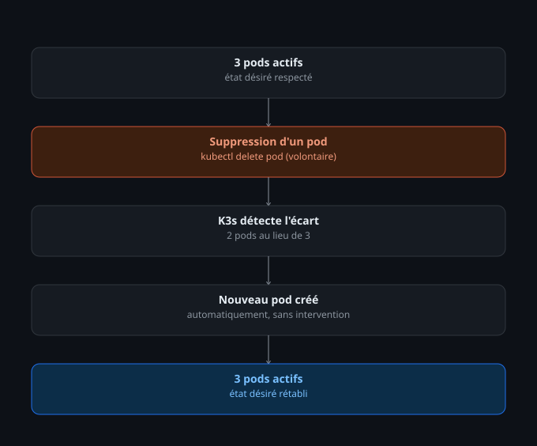
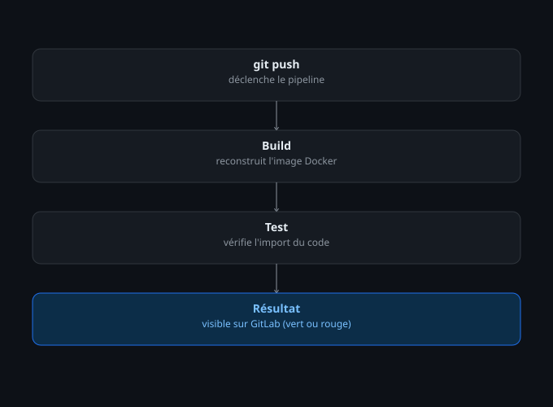
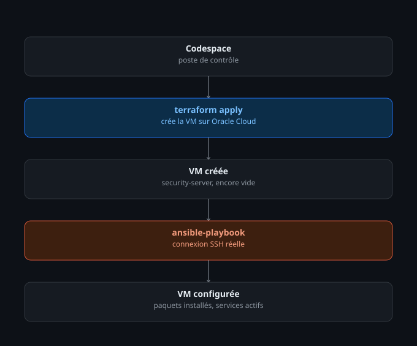
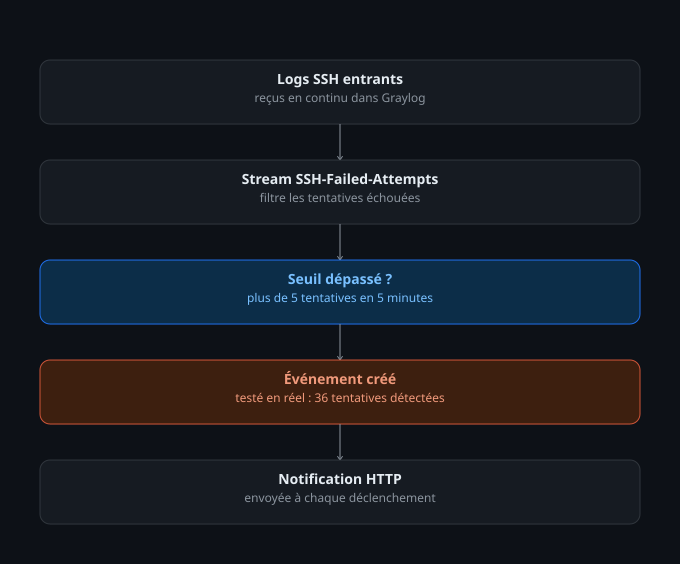
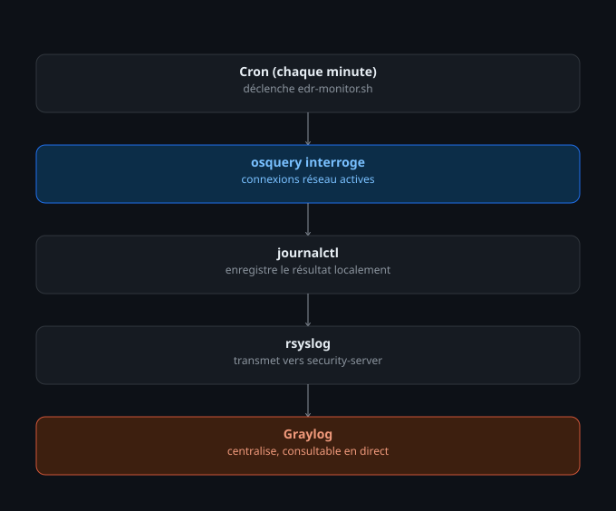
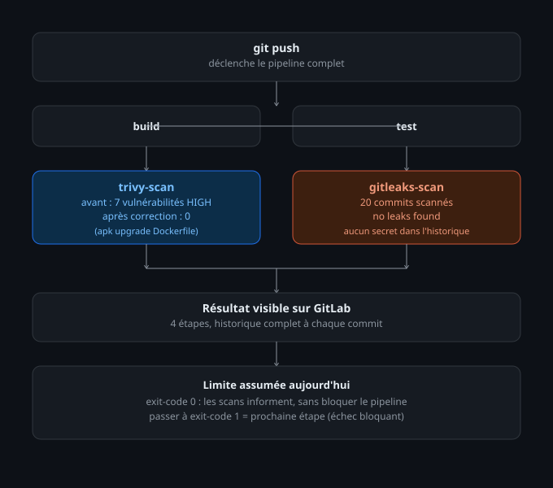
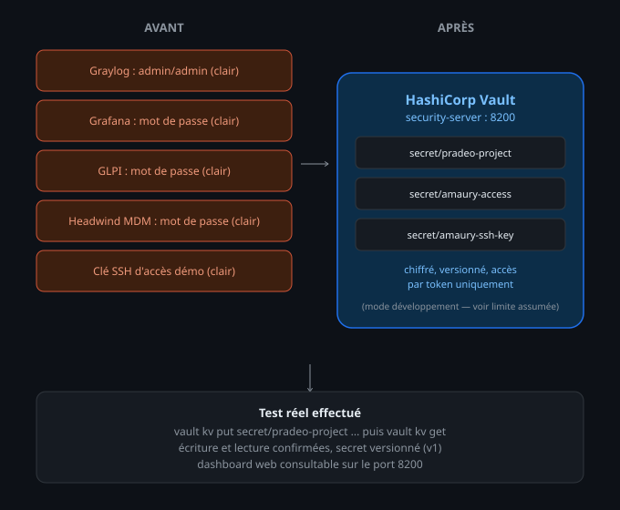
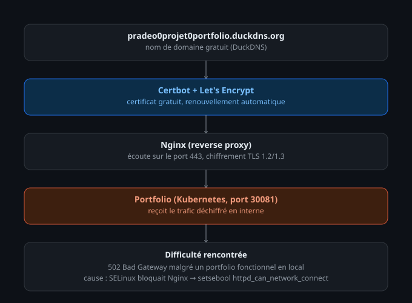

# 🛡️ Pradeo — Projet DevSecOps

<div align="center">


[](https://www.docker.com/)
[](https://kubernetes.io/)
[](https://www.terraform.io/)
[](https://www.ansible.com/)
[](https://www.oracle.com/cloud/)
[](https://graylog.org/)
[](https://grafana.com/)
[](https://glpi-project.org/)
[](https://h-mdm.com/)
[](https://www.vaultproject.io/)
[](https://letsencrypt.org/)


</div>

J'ai aussi construit un [guide complet de troubleshooting IT](https://github.com/Omarben04/it-troubleshooting-guide), qui rassemble les pannes que j'ai rencontrées ou observées, avec la méthode de diagnostic — plutôt orienté "comment réagir face à un incident", en complément de ce projet-ci qui est plutôt orienté "comment construire une infrastructure".

---

## Avant de commencer, un mot sur ce projet

Je m'appelle Omar, je suis étudiant en Licence Télécoms & Réseaux, en préparation de mon Mastère Cybersécurité & Cloud Computing. Je ne suis pas un professionnel du DevOps ni de la cybersécurité — je suis quelqu'un qui apprend en construisant, en cassant, et en recommençant.

Ce projet a démarré comme préparation à un entretien, puis j'ai continué à le faire évoluer parce que ça m'intéressait vraiment de pousser plus loin — jusqu'à transformer progressivement une infrastructure DevOps classique en une vraie démarche DevSecOps. Il n'est **pas parfait ni terminé** : certaines parties sont solides et testées en conditions réelles, d'autres sont volontairement simplifiées, et il reste des choses à faire pour le rendre encore plus complet (voir la section dédiée en bas).

Ce que je peux dire honnêtement : chaque brique de ce README a été **construite pas à pas, testée, et pour beaucoup, cassée puis réparée** — pas copiée-collée sans comprendre. Les difficultés rencontrées et leur résolution sont documentées volontairement en détail, parce que c'est souvent ça qui montre le mieux ce qu'on sait vraiment faire.

**Repos** : [GitHub](https://github.com/Omarben04/pradeo-devops-demo) (public) / [GitLab](https://gitlab.com/omar-devops/pradeo-it-demo) (privé, CI/CD)

---

## Accès à la démonstration

| Service | Lien |
|---|---|
| **Portfolio** (application de référence, Kubernetes, 3 replicas, HTTPS) | https://pradeo0projet0portfolio.duckdns.org/ |
| **Graylog** (SIEM) | http://89.168.55.236:9000/ |
| **Grafana** (Supervision) | http://141.253.111.20:3000/ |
| **Prometheus** (métriques brutes) | http://141.253.111.20:9090/ |
| **GLPI** (Gestion de parc + Tickets) | http://89.168.55.236/glpi/ |
| **Headwind MDM** | http://89.168.55.236:8082/ |
| **Vault** (Gestion des secrets) | http://89.168.55.236:8200/ |

**Les identifiants ne sont volontairement pas publiés dans ce README** — ne jamais laisser de secrets en clair dans un dépôt Git, même sur un projet de démonstration. Pour les obtenir, ainsi que l'accès SSH aux serveurs ou la console Oracle Cloud (lecture seule) : me contacter directement (omarbenmansour2004@gmail.com), je transmets un lien sécurisé à usage unique, qui expire après la première consultation.

---

## Architecture générale



Les deux VM sont sur le tier **Always Free** d'Oracle Cloud (architecture ARM Ampere) — un choix qui m'a coûté du temps (voir les difficultés ARM64 plus bas), mais qui reste 100% gratuit en permanence.

**Mise à jour depuis ce schéma** : un reverse proxy **Nginx** a depuis été ajouté sur `app-server`, devant le portfolio, avec un vrai certificat HTTPS (voir la section DevSecOps plus bas) — l'accès public passe désormais par ce proxy plutôt que directement par le port Kubernetes.

**Point honnête** : les deux VM communiquent aujourd'hui via leurs adresses IP publiques, par simplicité — pas via le réseau privé interne (VCN), ce qui serait plus propre. Pas de bastion, pas de sous-réseaux séparés. Voir la feuille de route en bas.

---

## 1. Application (Docker) — Portfolio

**Fichiers** : `portfolio/index.html`, `portfolio/style.css`, `portfolio/script.js`, `portfolio/Dockerfile`

Mon portfolio personnel, avec une interface façon système d'exploitation (fenêtres, terminal interactif), packagé en image Docker via Nginx.

**Vérifier** :
```bash
ssh amaury@141.253.111.20 "docker images | grep portfolio-omar && curl -s http://localhost:30081"
```

---

## 2. Kubernetes (k3d / K3s) — sur app-server

**Fichier** : `deployment-portfolio.yaml`

Le portfolio est déployé en **3 replicas**, avec un Service NodePort.

**Vérifier** :
```bash
ssh amaury@141.253.111.20 "kubectl get pods && kubectl get deployment portfolio-omar"
```

**Test de résilience** (recrée volontairement un pod) :
```bash
ssh amaury@141.253.111.20 "kubectl delete pod <nom-du-pod-portfolio> && kubectl get pods"
```
→ un nouveau pod apparaît automatiquement.

**Difficulté rencontrée** : au premier déploiement, le port n'était pas joignable depuis l'extérieur du cluster. J'ai découvert que k3d n'expose pas automatiquement des ports personnalisés — il faut le préciser explicitement à la création du cluster (`k3d cluster create -p "30081:30081@server:0"`). Ça m'a appris que "ça marche en local dans le conteneur" ne veut pas dire "c'est accessible de l'extérieur".



---

## 3. Pipeline CI/CD (GitLab)

**Fichier** : `.gitlab-ci.yml`

Build, test, puis deux scans de sécurité automatiques à chaque `git push`. Historique : https://gitlab.com/omar-devops/pradeo-it-demo/-/pipelines

Le détail complet des étapes de sécurité (Trivy, Gitleaks) est documenté dans la section **[De DevOps à DevSecOps](#de-devops-à-devsecops)** plus bas.



---

## 4. Infrastructure as Code (Terraform)

**Fichiers** : `terraform/main.tf` (provider Docker, sur Codespace), `terraform-oracle/*.tf` (provider OCI, vraie création de VM)

La VM `security-server` a été **entièrement créée par Terraform**, sans aucun clic manuel dans la console Oracle.

**Vérifier** :
```bash
cd terraform-oracle && terraform show | head -30
```



---

## 5. Automatisation (Ansible)

**Fichiers** : `ansible/setup.yml`, `ansible/setup-container.yml`, `ansible/inventory-oracle.ini`

Playbook exécuté à distance via une vraie connexion SSH.

**Vérifier** :
```bash
cd ansible && ansible-playbook -i inventory-oracle.ini setup-oracle.yml
```
→ à la deuxième exécution : `changed=0` (idempotence).

**Difficulté rencontrée** : Ansible restait bloqué indéfiniment sur "Gathering Facts" en se connectant depuis mon Codespace vers Oracle Cloud, alors qu'une connexion SSH manuelle fonctionnait en moins d'une seconde. En creusant avec le mode verbeux (`-vvv`), j'ai découvert que le multiplexing SSH d'Ansible (`ControlMaster`) posait problème dans cet environnement précis. Je l'ai désactivé et forcé l'authentification directe par clé — ça a tout débloqué.

---

## 6. SIEM (Graylog) — sur security-server

Centralise les logs système en continu. `app-server` envoie tous ses logs via `rsyslog` vers Graylog (port 1514/UDP).

**Vérifier en direct** :
1. http://89.168.55.236:9000/
2. Menu **Search** → `source:app-server`
→ des centaines de vrais logs système, alimentés en continu.

**Pourquoi Graylog et pas Wazuh** : Wazuh était mon premier choix, mais je me suis heurté à un mur : son script d'installation refuse explicitement les architectures non-x86_64, et l'émulation Docker que j'ai testée en renfort a aussi échoué (`exec format error`). J'ai compris que c'était lié au choix de l'architecture ARM de mes VM (gratuite, mais moins supportée). Graylog, conçu multi-architecture dès le départ, a fonctionné sans aucun souci.

### Alerte SIEM — détection de brute-force SSH

J'ai poussé un peu plus loin en configurant une vraie alerte : un stream Graylog dédié détecte les tentatives de connexion SSH échouées, avec une règle qui se déclenche si plus de 5 tentatives sont détectées en 5 minutes.

**Test réel effectué** : l'alerte s'est déclenchée avec **36 tentatives détectées** en une seule fenêtre de 5 minutes — mon serveur, comme tout serveur exposé publiquement, se fait scanner en continu par des robots. C'était à la fois inquiétant et une bonne occasion de tester une vraie alerte en conditions réelles, pas juste simulées.

**Vérifier** : Menu **Alerts** → **Alerts & Events** dans Graylog.



---

## 7. Supervision (Prometheus + Grafana) — sur app-server

Collecte CPU, RAM, disque, réseau en temps réel via `node-exporter`.

**Vérifier en direct** : http://141.253.111.20:3000/, dashboard "Node Exporter Full".

**Pourquoi Prometheus/Grafana et pas Zabbix** : j'ai d'abord tenté Zabbix, mais son image `zabbix-server-mysql` refusait obstinément de démarrer, coincée dans une boucle avec l'erreur "users table is empty" — comme si sa base de données n'était jamais complètement initialisée. J'ai essayé plusieurs approches (réinitialiser la base, forcer l'ordre de démarrage des conteneurs, importer le schéma SQL manuellement), sans succès durable. Après un moment, j'ai choisi de ne pas m'acharner et de basculer vers Prometheus + Grafana, qui a fonctionné du premier coup. Je considère ça comme une vraie leçon : savoir quand persister et quand changer de stratégie fait aussi partie du travail.

---

## 8. EDR renforcé (osquery + fail2ban) — sur les deux VM

Plutôt que de me contenter d'osquery seul (qui ne fait qu'observer), j'ai voulu comprendre ce qui différencie ça d'un vrai EDR : la **réaction automatique**.

**Détection continue** : un script (`security-configs/edr-monitor.sh`) tourne chaque minute via cron, interroge osquery sur les connexions réseau actives, et remonte automatiquement dans Graylog.

**Réaction automatique (fail2ban)** : détecte et bloque les IP qui scannent le serveur en SSH.

**Test réel effectué** : fail2ban a détecté et banni automatiquement plus de 90 IP qui scannaient en continu mon serveur.

**Difficulté rencontrée, et ce qu'elle m'a appris** : la première tentative d'installation de fail2ban avait déjà échoué plus tôt dans le projet. Cette fois, en l'installant directement et en activant le dépôt EPEL correctement, ça a fonctionné — mais fail2ban ne bannissait toujours rien, alors que les logs montraient clairement des dizaines de tentatives suspectes. En testant le filtre avec `fail2ban-regex`, j'ai découvert que le filtre standard classait ces tentatives précises comme "non malveillantes" par défaut — trop permissif pour mon cas. Le mode `aggressive` du filtre a résolu le problème.

**Vérifier** :
```bash
ssh amaury@141.253.111.20 "sudo fail2ban-client status sshd"
```

**Limite assumée** : cette combinaison reste plus simple qu'un EDR commercial complet, mais elle démontre concrètement les deux piliers d'un EDR : observer, puis agir.



---

## 9. Gestion de parc et ticketing (GLPI) — sur security-server

Installé pour répondre directement aux missions "support des utilisateurs internes" et "gestion du parc informatique".

**Fonctionnalités testées** : les deux VM enregistrées comme équipements dans l'inventaire, un ticket de démonstration créé et consultable dans le module Assistance.

**Vérifier en direct** : http://89.168.55.236/glpi/ → Menu **Parc** → **Ordinateurs**, et **Assistance** → **Tickets**

**Difficulté rencontrée** : l'image Docker officielle de GLPI ne supporte que l'architecture x86_64. J'ai donc installé GLPI **nativement** (PHP, Apache, MariaDB), ce qui a aussi soulevé un blocage inattendu : une erreur 403 malgré des permissions de fichiers apparemment correctes. La cause était SELinux (présent sur Oracle Linux, plus strict que sur Ubuntu/Debian), qui bloquait l'accès par défaut. Je l'ai configuré correctement avec `semanage` et `restorecon`, plutôt que de simplement le désactiver.

**Limite assumée** : mot de passe par défaut conservé pour la durée de cette démonstration.

---

## 10. MDM (Headwind MDM) — sur security-server

C'est la brique qui m'a demandé le plus de persévérance. J'ai tenté **trois solutions MDM différentes avant celle-ci** :

1. **Fleet** — aucune image Docker ARM64 disponible, échec immédiat (`exec format error`)
2. **Flyve MDM** — impossible de trouver les bonnes URLs de téléchargement ; en creusant, j'ai découvert que le projet est en réalité abandonné par son éditeur depuis 2021 (dépôts archivés)
3. **Headwind MDM (image officielle)** — même erreur `exec format error` que Fleet : l'image Docker publiée par l'éditeur n'existe qu'en x86_64

Face à ce troisième échec, plutôt que d'abandonner, j'ai cherché à comprendre **pourquoi** exactement ça bloquait — et j'ai découvert que le code source de Headwind MDM (en Java/Tomcat) n'a en réalité aucune limitation d'architecture ; seule leur image Docker pré-compilée était en cause. J'ai donc **reconstruit l'image moi-même, directement sur ma VM ARM**, à partir de leur Dockerfile officiel — et ça a fonctionné du premier coup.

**Fonctionnalités testées** :
- Deux appareils enregistrés dans l'inventaire
- Configuration "Common - Minimal" fonctionnelle : suivi de localisation, gestion des permissions, contrôle Bluetooth/Wi-Fi/données mobiles, exigences de mot de passe, mode kiosque
- Communication MQTT via Apache ActiveMQ

**Vérifier en direct** : http://89.168.55.236:8082/ → Onglet **Appareils** et **Configurations**

**Stack** : PostgreSQL (base dédiée, séparée de la MariaDB de GLPI), Apache ActiveMQ, Tomcat/Java.

**Limite assumée** : accessible en HTTP simple, aucun vrai terminal physique connecté.

---

## Script de vérification automatique de l'infrastructure

**Fichier** : `verify-infra.sh`

Après avoir enchaîné plusieurs pannes et redémarrages en cours de route, j'ai voulu un moyen rapide de vérifier que tout fonctionnait encore avant de montrer le projet à quelqu'un. Ce script teste 23 points critiques : connectivité SSH, Docker, Kubernetes, accessibilité des services web, santé de Graylog, accès de démonstration, osquery, fail2ban, GLPI, Headwind MDM.

**Utiliser** :
```bash
./verify-infra.sh
```

**Résultat attendu** : `23 tests reussis, 0 tests echoues`

---

## De DevOps à DevSecOps

Après avoir construit l'infrastructure, j'ai voulu comprendre concrètement ce qui distingue DevOps de DevSecOps — pas juste en le lisant, mais en le construisant brique par brique, avec de vrais résultats mesurables avant/après.



### 1. Scan de sécurité automatique (Trivy) — intégré au pipeline CI/CD

Trivy s'exécute désormais **automatiquement à chaque `git push`**, comme étape du pipeline GitLab, plutôt qu'en scan manuel ponctuel comme au tout début du projet.

**Résultat réel, avant/après** : 7 vulnérabilités HIGH détectées initialement sur l'image portfolio (bibliothèque `libuuid`, Alpine 3.24.1) → **0 vulnérabilité** après ajout d'un `apk upgrade` dans le Dockerfile, confirmé automatiquement par le pipeline suivant.

**Tester** :
```bash
# Voir le résultat dans GitLab
# https://gitlab.com/omar-devops/pradeo-it-demo/-/pipelines → étape "trivy-scan"

# Ou reproduire localement
cd portfolio && docker build -t portfolio-test . && trivy image --severity HIGH,CRITICAL portfolio-test
```

**Difficulté rencontrée** : la première tentative utilisait l'image Docker officielle `aquasec/trivy` comme image principale du job, mais son `ENTRYPOINT` est déjà fixé sur la commande `trivy` — l'exécution du script GitLab échouait avec `unknown command "sh" for "trivy"`. Résolu en utilisant l'image `docker:24` standard et en installant Trivy comme outil supplémentaire, plutôt que de l'utiliser comme image de base.

### 2. Détection de secrets (Gitleaks) — intégrée au pipeline

Scanne tout l'historique Git à chaque push, à la recherche de mots de passe ou clés accidentellement committés.

**Résultat réel** : 20 commits scannés, `no leaks found`.

**Tester** :
```bash
# Voir le résultat dans GitLab, étape "gitleaks-scan"

# Ou reproduire localement
gitleaks detect --source . --verbose
```

**Même difficulté rencontrée et résolue que pour Trivy** : l'image officielle `zricethezav/gitleaks` a le même conflit d'`ENTRYPOINT` — corrigé en installant Gitleaks sur une image Alpine générique.

### 3. Gestion centralisée des secrets (HashiCorp Vault)



Installé sur `security-server`, centralise tous les mots de passe du projet (Graylog, Grafana, GLPI, Headwind MDM, bases de données), ainsi que les identifiants transmis pour la démonstration (accès Oracle Cloud, clé SSH).

**Tester** :
```bash
# Interface web
# http://89.168.55.236:8200 (token transmis séparément)

# Ou en ligne de commande, une fois connecté à security-server
docker exec -e VAULT_ADDR=http://127.0.0.1:8200 -e VAULT_TOKEN=<token> vault vault kv get secret/pradeo-project
```

**Limite assumée** : Vault tourne en **mode développement** (simple pour une démo, non scellé, pas adapté à une vraie production) — un déploiement réel nécessiterait un mode "production" avec dé-scellement manuel et stockage persistant chiffré.

### 4. HTTPS réel (Nginx + Let's Encrypt)



Le portfolio est accessible en HTTPS avec un vrai certificat, via un reverse proxy Nginx et un nom de domaine gratuit — plus de HTTP simple ni de certificat auto-signé avec avertissement.

**Tester** :
```bash
curl -I https://pradeo0projet0portfolio.duckdns.org
# Doit renvoyer 200, sans avertissement de certificat
```

Ou directement dans un navigateur : https://pradeo0projet0portfolio.duckdns.org

**Comment ça a été mis en place** : nom de domaine gratuit (DuckDNS) pointant vers l'IP publique de `app-server`, certificat Let's Encrypt généré via Certbot, renouvellement automatique déjà configuré.

**Difficulté rencontrée** : après la configuration initiale, Nginx renvoyait une erreur `502 Bad Gateway` bien que le portfolio répondait correctement en local. Diagnostic via `/var/log/nginx/error.log` : `Permission denied` — un blocage SELinux, résolu avec `setsebool -P httpd_can_network_connect 1` pour autoriser Nginx à initier des connexions réseau sortantes vers d'autres ports.

### 5. Scan de l'infrastructure as Code (Checkov)

Analyse la configuration Terraform à la recherche d'erreurs de sécurité, avant même que l'infrastructure ne soit créée.

**Résultat réel, avant/après** : 2 échecs détectés initialement sur la VM `security_server` (endpoint de métadonnées legacy actif, chiffrement en transit du disque désactivé) → **4/4 checks passés** après correction du fichier Terraform et application via `terraform apply` (modification en place, sans recréation de la VM ni interruption des services).

**Tester** :
```bash
pip install checkov --break-system-packages
cd terraform-oracle && checkov -d . --compact
```

### Ce qui reste à faire pour un DevSecOps complet

- **SAST (analyse statique du code source)** : scanner le code lui-même avant la construction, avec un outil comme Semgrep
- **Politique de déploiement conditionnée à la sécurité** : aujourd'hui, Trivy et Gitleaks informent sans bloquer le pipeline (`exit-code 0`) — passer à un mode strict qui empêche le déploiement en cas de vulnérabilité critique
- **Vault en mode production** : dé-scellement manuel, stockage persistant, plutôt que le mode développement actuel

---

## Ce qui n'est pas encore fait — et ce que je referais différemment

- **Mots de passe par défaut** sur certains services (GLPI, Grafana) — désormais centralisés dans Vault, mais pas encore changés à la source.
- **Communication inter-serveurs par IP publique** : mes deux VM communiquent aujourd'hui via leurs adresses publiques (par simplicité), alors qu'une vraie architecture devrait privilégier le réseau privé interne (VCN), avec un bastion pour l'accès administratif.
- **Autoscaling Kubernetes** : je démontre le maintien d'un nombre fixe de replicas, pas l'ajustement automatique à la charge (HorizontalPodAutoscaler).
- **Pipeline non bloquant** : Trivy et Gitleaks informent aujourd'hui sans empêcher un déploiement en cas de problème détecté.
- **MDM sans vrai terminal connecté** : Headwind MDM est configuré et fonctionnel côté serveur, mais je n'ai pas testé l'enrôlement d'un vrai smartphone.
- **Sauvegardes** : aucune stratégie de sauvegarde automatisée n'est en place pour les bases de données — un vrai risque si une VM tombait.
- **SAST et Vault en mode production** : voir la section DevSecOps ci-dessus.

Je considère ce projet comme une base solide, pas un point d'arrivée. Chaque limite listée ici est une prochaine chose que je veux apprendre à faire correctement.

---

## Documentation complémentaire

- [**ADR — Architecture Decision Records**](docs/decisions.md) : le détail des principales décisions techniques prises pendant le projet, avec le contexte, les options considérées et les conséquences assumées.

---

## Stack technique complète

| Domaine | Outils |
|---|---|
| Conteneurisation | Docker |
| Orchestration | Kubernetes (k3d/K3s) |
| CI/CD | GitLab CI/CD (build, test, scans de sécurité automatiques) |
| Infrastructure as Code | Terraform (providers Docker et OCI) |
| Configuration | Ansible (SSH réel et connexion Docker native) |
| SIEM | Graylog, avec alerte de détection brute-force |
| Supervision | Prometheus, Grafana, node-exporter |
| EDR | osquery (détection continue) + fail2ban (réaction automatique) |
| Scan de vulnérabilités | Trivy (intégré au pipeline CI/CD) |
| Détection de secrets | Gitleaks (intégré au pipeline CI/CD) |
| Gestion des secrets | HashiCorp Vault |
| Scan de l'infrastructure (IaC) | Checkov |
| HTTPS | Nginx (reverse proxy) + Let's Encrypt (Certbot) + DuckDNS |
| Gestion de parc / Ticketing | GLPI (installation native, SELinux configuré) |
| MDM | Headwind MDM (image reconstruite pour ARM64) |
| Versioning | Git (GitHub + GitLab) |
| Cloud | Oracle Cloud Infrastructure (Always Free, ARM) |
| Sécurité réseau | firewalld, Oracle Security Lists, accès SSH par clé, IAM en lecture seule |
